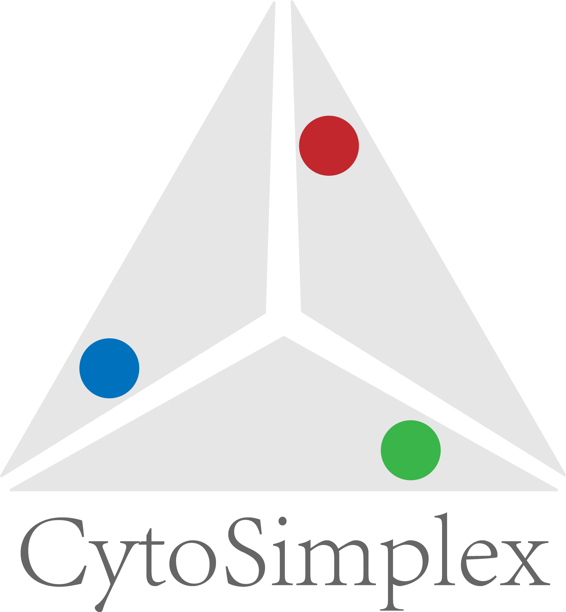

# CytoSimplex

[](https://github.com/welch-lab/pyCytoSimplex/actions/workflows/python-package.yml)[](https://codecov.io/gh/mvfki/pyCytoSimplex)[](https://pypi.org/project/anndata/)

"CytoSimplex" is a Python module that creates simplex plot showing similarity between single-cells and terminals represented by clusters of cells.
RNA velocity can be added as another layer of information.

For R users, we have an R package [CytoSimplex](https://github.com/welch-lab/CytoSimplex) that provides the same functionalities.

CytoSimplex can be installed with the shell/command-line command:

```bash
pip install cytosimplex
```

We have build a [documentation website](https://pycytosimplex.readthedocs.io/en/latest/index.html) for:
- [Detailed instruction for installation](https://pycytosimplex.readthedocs.io/en/latest/installation.html)
- [Walkthrough example from loading data to creating different simplex visualization](https://pycytosimplex.readthedocs.io/en/latest/example/index.html)

If you used CytoSimplex in your work, please cite the following work:

>[Jialin Liu, Yichen Wang, Chen Li, Yichen Gu, Noriaki Ono and Joshua D. Welch, CytoSimplex: Visualizing Single-cell Fates and Transitions on a Simplex, 2023, bioRxiv](https://doi.org/10.1101/2023.12.07.570655)
