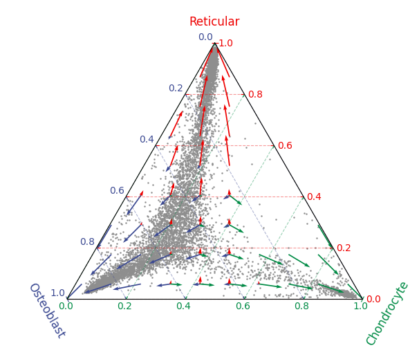

.. CytoSimplex documentation master file, created by
   sphinx-quickstart on Sun Oct  1 13:01:45 2023.
   You can adapt this file completely to your liking, but it should at least
   contain the root `toctree` directive.

==============================================================================
CytoSimplex, Simplex Visualization of Cell Fate Similarity in Single-Cell Data
==============================================================================

.. image:: https://github.com/mvfki/pyCytoSimplex/actions/workflows/python-package.yml/badge.svg
   :target: https://github.com/mvfki/pyCytoSimplex/actions/workflows/python-package.yml
.. image:: https://codecov.io/gh/mvfki/pyCytoSimplex/branch/main/graph/badge.svg?token=L839lYPVon
   :target: https://codecov.io/gh/mvfki/pyCytoSimplex
.. image:: https://img.shields.io/badge/AnnData-0.9.1-blue
   :target: https://pypi.org/project/anndata/

A simplex scatter plot is a visualization method where each dot is placed basing on its barycentric coordinates.
For example, in a 2-simplex ("2" means "in 2D", and 2-simplex is basically a triangle, so we also call it a ternary simplex),
we denote each of the three vertices as a presentation of a certain terminal cell fate, and we calculate the similarity
between each cell to each terminal. By converting the similarity to the three vertices into a triplet of barycentric coordinates
in the simplex, we can visualize the similarity of each cell to each terminal cell fate in a 2D plot. We initially proposed
this method of simplex cell fate visualization in our study of bone marrow endosteal stem cells [1]_.
We generalized this method to also 1-simplex (a two-ended line) and 3-simplex (a tetrahedron) (**TODO** another footnote after the paper comes out).

This site presents the documentation of the Python package "CytoSimplex". We developed it basing on tests with
transcriptomic data (scRNAseq) and chromatin accessibility data (scATACseq). Meanwhile, RNA velocity can be added as another
layer of information, as the arrows shown in the example plot above.

.. toctree::
   :maxdepth: 2
   :caption: Contents:

   installation
   example/index
   api/index
   release-notes/index

.. role:: small

.. [1] Matsushita, Y., Liu, J., Chu, A.K.Y. et al. Bone marrow endosteal stem cells dictate active osteogenesis and aggressive tumorigenesis. Nat Commun 14, 2383 (2023). https://doi.org/10.1038/s41467-023-38034-2
